**REQUIRED BACKGROUND:** `superpowers:test-driven-development`
**REQUIRED SUB-SKILL:** `superpowers:verification-before-completion`
If either unavailable, tell user to run `claude plugin add anthropic/superpowers` and **stop**.

> Prerequisites are prompt instructions in context. "Follow skill X" = apply its rules during that phase, no separate invocation.

## Overview

Orchestrates project construction via 5 TDD phases: ASSESS, ARCHITECT, BUILD, INTEGRATE, VERIFY DOCS. Enforces full test pyramid (unit, functional, integration, e2e), living docs, and modular quality via review gates. Extends superpowers TDD.

## Session Continuity

On load: check git log, tests, docs, uncommitted changes. Resume earliest incomplete phase/sub-step (including mid-module). No progress → start normally.

## Phase 1: ASSESS

- **Greenfield** → Phase 2.
- **Existing with tests** → run existing tests, identify untested modules/branches, carry gap list into Phase 2.
- **Legacy (no tests)** → read `legacy-code-strategy.md`, characterization tests first. Never modify untestable code.

## Phase 2: ARCHITECT

Inside-out: Core (pure logic, zero deps) → Service → Interface (API/CLI/UI) → Infrastructure. Dependencies inward only. Module = smallest unit, single responsibility, public interface.

- Infrastructure projects: define interfaces alongside core, build core against them, concrete adapters last.
- Per module: responsibility, I/O contract, test file alongside.
- Doc stubs: README.md, ARCHITECTURE.md, API.md, TESTING.md, CONTRIBUTING.md.

## Phase 3: BUILD (per module, inside-out)

1. **Unit tests** — follow `superpowers:test-driven-development` RED-GREEN-REFACTOR.
2. **Implement** until green.
3. **Functional tests** — module behavior as whole.
4. **Refactor**.
5. **Review gate** — subagent via Agent tool + modularity rules. Must PASS. Fail → fix → resubmit.
6. **Update docs** — code + project level.
7. **Commit** code + docs together. One per module; large modules may commit at steps 2/4.

## Phase 4: INTEGRATE

1. **Integration tests** — module boundaries.
2. **E2e tests** — complete user workflows.
3. **Full suite** — all four types pass.
4. Follow `superpowers:verification-before-completion`.

## Phase 5: VERIFY DOCS

Final pass (stubs created Phase 2, maintained throughout):
- **README.md** — quick start, install, usage complete.
- **ARCHITECTURE.md** — module map matches structure, data flow correct.
- **API.md** — all public interfaces, no stale refs.
- **TESTING.md** — strategy current, run instructions work.
- **CONTRIBUTING.md** — setup tested, conventions match code.

Litmus: could a new dev understand this repo in 30 minutes?

## Flowchart

```dot
digraph phases {
    "ASSESS\ncodebase state" [shape=box];
    "Greenfield?" [shape=diamond];
    "Legacy?" [shape=diamond];
    "Read legacy-code-strategy.md" [shape=box];
    "Write characterization tests" [shape=box];
    "ARCHITECT\nmodular structure + doc stubs" [shape=box];
    "BUILD\n(per module, inside-out)" [shape=box];
    "Read test-pyramid-guide.md" [shape=box];
    "Unit tests (follow TDD skill)" [shape=box];
    "Implement until green" [shape=box];
    "Functional tests" [shape=box];
    "Refactor" [shape=box];
    "Read modularity-rules.md" [shape=box];
    "Review gate (Agent)" [shape=box];
    "Gate pass?" [shape=diamond];
    "Read documentation-standards.md" [shape=box];
    "Update docs + commit" [shape=box];
    "More modules?" [shape=diamond];
    "INTEGRATE\nintegration + e2e tests" [shape=box];
    "Full suite green?" [shape=diamond];
    "Verification (follow verification skill)" [shape=box];
    "VERIFY DOCS\nfinal review pass" [shape=box];
    "Done" [shape=doublecircle];

    "ASSESS\ncodebase state" -> "Greenfield?";
    "Greenfield?" -> "ARCHITECT\nmodular structure + doc stubs" [label="yes"];
    "Greenfield?" -> "Legacy?" [label="no"];
    "Legacy?" -> "Read legacy-code-strategy.md" [label="yes, no tests"];
    "Map coverage gaps" [shape=box];
    "Legacy?" -> "Map coverage gaps" [label="no, has tests"];
    "Map coverage gaps" -> "ARCHITECT\nmodular structure + doc stubs";
    "Read legacy-code-strategy.md" -> "Write characterization tests";
    "Write characterization tests" -> "ARCHITECT\nmodular structure + doc stubs";
    "ARCHITECT\nmodular structure + doc stubs" -> "BUILD\n(per module, inside-out)";
    "BUILD\n(per module, inside-out)" -> "Read test-pyramid-guide.md";
    "Read test-pyramid-guide.md" -> "Unit tests (follow TDD skill)";
    "Unit tests (follow TDD skill)" -> "Implement until green";
    "Implement until green" -> "Functional tests";
    "Functional tests" -> "Refactor";
    "Refactor" -> "Read modularity-rules.md";
    "Read modularity-rules.md" -> "Review gate (Agent)";
    "Review gate (Agent)" -> "Gate pass?";
    "Gate pass?" -> "Read documentation-standards.md" [label="yes"];
    "Gate pass?" -> "Refactor" [label="no, fix violations"];
    "Read documentation-standards.md" -> "Update docs + commit";
    "Update docs + commit" -> "More modules?";
    "More modules?" -> "BUILD\n(per module, inside-out)" [label="yes"];
    "More modules?" -> "INTEGRATE\nintegration + e2e tests" [label="no"];
    "INTEGRATE\nintegration + e2e tests" -> "Full suite green?";
    "Full suite green?" -> "Verification (follow verification skill)" [label="yes"];
    "Full suite green?" -> "INTEGRATE\nintegration + e2e tests" [label="no, fix"];
    "Verification (follow verification skill)" -> "VERIFY DOCS\nfinal review pass";
    "VERIFY DOCS\nfinal review pass" -> "Done";
}
```

## Reference Files

All reference files live in this skill's directory (alongside SKILL.md). Read before acting: Phase 1 legacy → `legacy-code-strategy.md` | Phase 3 tests → `test-pyramid-guide.md` | Phase 3.5 gate → `modularity-rules.md` | Phase 3/4/5 docs → `documentation-standards.md`

---

**Golden rule:** Every code change triggers a documentation update in the same commit. No exceptions.
